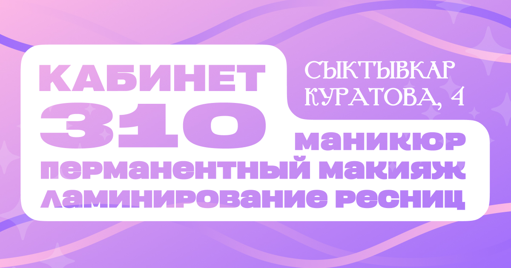

  

<h1 align="center">cabinet310_next</h1>

  

  Современная веб-система онлайн-записи и управления студией красоты «Кабинет 310».  

---

<b>Русская версия</b>

## Описание

**Кабинет 310** — это полнофункциональное веб-приложение для автоматизации процессов онлайн-записи клиентов, управления расписанием мастеров, модерации отзывов и ведения учета бьюти-студии.  
Система включает современный веб-интерфейс, умный расчет доступности слотов с учетом матрицы конфликтов, административную панель, VK-бота для приёма заявок из соцсетей и мобильное приложение для администратора.

---

## ⚙️ Структура проекта

### Страницы

| Страница | Назначение |
|-----------|-------------|
| `/` | **Главная страница** студии с информацией о мастерах, портфолио и акциях |
| `/booking` | **Пошаговая онлайн-запись** (Stepper: выбор услуги → дата и время → данные клиента) |
| `/services` | **Каталог услуг** и актуальный прайс-лист студии |
| `/reviews` | Страница **отзывов** клиентов с формой отправки и загрузкой фотографий |
| `/contacts` | **Контакты**, схема проезда и интерактивная карта |
| `/privacy` | **Политика конфиденциальности** и обработки персональных данных |
| `/qr` | Страница быстрого перехода и записи по **QR-коду** |
| `/admin` | **Панель управления** (записи, слоты, услуги, акции, отзывы, клиенты) |
| `/admin/login` | **Страница авторизации** администраторов студии |

---

### Технологии

| Категория | Используемые технологии |
|------------|-------------------------|
| Core | HTML5, CSS3, TypeScript, JavaScript |
| Framework | Next.js 16 (App Router), React 19 |
| Database & ORM | SQLite, Prisma ORM, LibSQL |
| Styling & UI | Tailwind CSS v4, Vanilla CSS, Material Symbols, Chart.js, React Hot Toast, Swiper |
| Mobile App | Capacitor (Android приложение в `mobile-admin`) |
| Security & Auth | JWT (jose / jsonwebtoken), bcryptjs, Middleware Protection |
| Integrations | VK Bot API (автоматическая запись через ВКонтакте) |

---

### Логика

- **Пошаговое бронирование**: Процесс записи разделён на логические шаги (выбор процедуры, мастера, времени и заполнение данных).
- **Умная матрица конфликтов (Conflict Matrix)**: Алгоритм проверки доступности слотов рассчитывает пересечения по мастерам, кабинетам и параллельным услугам.
- **Админ-панель**: Управление расписанием, ручная блокировка слотов, редактирование услуг, публикация акций и модерация отзывов.
- **Интеграция с ВКонтакте**: Встроенный VK-бот обрабатывает запросы пользователей и записывает их через REST API.
- **Мобильное административное приложение**: Настроена сборка на базе Capacitor (`mobile-admin`) для удобного управления со смартфона.

---

### Особенности

- Полный цикл автоматизации бьюти-студии (от бронирования до администрирования)
- Умный алгоритм контроля конфликтов рабочего времени мастеров и посадочных мест
- Мультиплатформенность: Веб-сайт + Mobile App (Capacitor) + VK Bot
- Безопасная система авторизации на основе JWT и Next.js Middleware
- Гибкое управление прайсом, акциями, слотами и базами клиентов

---

<b>English Version</b>

## Project

A modern web application and management system for the beauty studio **"Cabinet 310"**.  
Designed to automate client bookings, master schedules, review moderation, and studio management ❤️  

Built with **Next.js 16 (App Router)**, **React 19**, **Prisma ORM**, and **SQLite**, with **Capacitor** for mobile builds and a **VK Bot integration**.

---

## ⚙️ Project Structure

### Pages

| Page | Description |
|------|--------------|
| `/` | **Home page** featuring studio portfolio, promotions, and services |
| `/booking` | **Step-by-step online booking** wizard (Service → Date/Time → Client Info) |
| `/services` | **Services & price list** catalog |
| `/reviews` | **Reviews page** with user feedback form and photo upload |
| `/contacts` | **Contacts page** with address, location map, and studio details |
| `/privacy` | **Privacy policy** and terms of service |
| `/qr` | Quick redirect page for **QR-code** scanning |
| `/admin` | **Admin Dashboard** (bookings, blocked slots, prices, promos, reviews, clients) |
| `/admin/login` | **Admin authentication** page |

---

### Technologies

| Category | Used Technologies |
|-----------|------------------|
| Core | HTML5, CSS3, TypeScript, JavaScript |
| Framework | Next.js 16 (App Router), React 19 |
| Database & ORM | SQLite, Prisma ORM, LibSQL |
| Styling & UI | Tailwind CSS v4, Vanilla CSS, Material Symbols, Chart.js, React Hot Toast, Swiper |
| Mobile App | Capacitor (Android app in `mobile-admin`) |
| Security & Auth | JWT (jose / jsonwebtoken), bcryptjs, Middleware Protection |
| Integrations | VK Bot API (Automated VKontakte booking bot) |

---

### Logic

- **Step-by-step wizard**: Intuitive multi-step booking process for clients.
- **Smart Conflict Matrix**: Real-time availability checks preventing double-booking of masters and studio rooms.
- **Admin Dashboard**: Comprehensive control panel to manage bookings, block slots, edit price lists, moderate reviews, and track clients.
- **VK Bot Integration**: Built-in webhook handler for booking through VKontakte chat.
- **Mobile Admin Client**: Capacitor-powered Android app layout for management on mobile devices.

---

### Highlights

- Full-cycle studio automation (Client Booking → VK Bot → Admin Dashboard → Mobile App)
- Real-time slot matrix preventing schedule & workspace conflicts
- Multi-platform accessibility: Web + Mobile (Capacitor) + Social Media (VK Bot)
- Secure JWT authentication with Next.js Middleware route guards
- Dynamic control over price lists, promos, schedules, and client records

---

